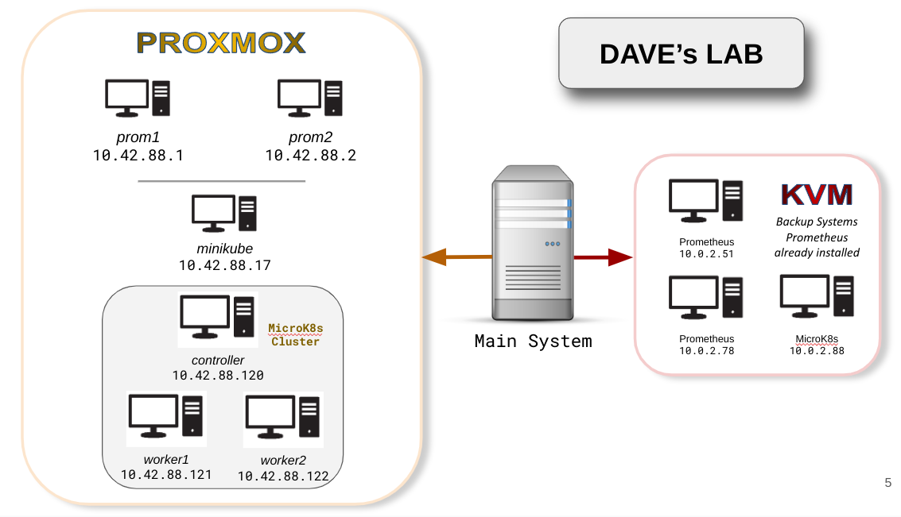

# Using Prometheus to Monitor Linux and Kubernetes

Copyright © Dave Prowse

Website: https://prowse.tech

Discord Server: https://discord.gg/mggw8VGzUp

---

This is the repository for the live webinar:

***Using Prometheus to Monitor Linux and Kubernetes***

All of the labs can be found within.

Link: https://github.com/daveprowse/prom-live

## Prepare Linux VMs!

Although you can get away with a single Linux system for this course, I highly recommend that you prepare at least two, local, Linux virtual machines in a NAT network. One to run Prometheus, and the other to be monitored. This is a best practice that will allow your systems to be somewhat isolated from your main system and network. Make sure that your main system can communicate with the virtual machines via SSH and web browser.

The scripts and labs are designed for **Ubuntu** 24/04 & 22.04 Server or **Debian** 12 server (x64 platform). Remember to work as root or as a user with sudo powers.

If you don't have either Debian or Ubuntu you can download them from the following links.

- Debian 12 [Download](https://www.debian.org/download)
- Ubuntu 24.04 Server [Download](https://releases.ubuntu.com/24.04/)
- Ubuntu 22.04 Server [Download](https://releases.ubuntu.com/jammy/ubuntu-22.04.4-live-server-amd64.iso)

> Note: If you choose to run Debian, make sure that you install it as a server. To do so, deselect any desktops (GNOME, KDE, etc...) during the Task Selection phase of the installation.

Most importantly, to install Prometheus see the first lab at [this link](./labs/lab-01/README.md).

## Kubernetes

You might also be interested in running, and monitoring, Kubernetes. During the course I'll be monitoring the following:

- **Vanilla Kubernetes cluster** (three Ubuntu virtual machines). For scripts and details for installing an actual Kubernetes cluster, click [here](./z-more-info/k8s-scripts/README.md).

- **MiniKube**: For details on how to setup a Minkube, click [here](./z-more-info/minikube/minikube-install.md). If you want to run minikube then I recommend doing it on a Linux system with a GUI (desktop interface).

You can also build K8s in the following ways:
- Quick builds for Go or Docker environments: Click [here](https://github.com/kubernetes/kubernetes)
- AWS EKS: For more information from AWS, click [here](https://aws.amazon.com/eks/).
- Google GKE: For more information from Google, click [here](https://cloud.google.com/kubernetes-engine).

> Note: You can use other tools such as kind, kOps, and Karpenter, as well as other cloud-based services (Azure, DO, Linode), but I won't be covering those in the course.

> Note: I build my K8s clusters on AWS and Google with Terraform. If you are interested in using Terraform to build K8s, see the following documentation:
> - AWS EKS: [Link](https://registry.terraform.io/providers/hashicorp/aws/latest/docs/resources/eks_cluster) 
> - Google GKE: [Link](https://registry.terraform.io/providers/hashicorp/google/latest/docs/guides/using_gke_with_terraform)
> - You will also want to install `kubectl` on your main system: [Link](https://kubernetes.io/docs/tasks/tools/install-kubectl-linux/)
>
> For more about Terraform see my video course [here](https://learning.oreilly.com/videos/hashicorp-certified-terraform/9780138195366/).

---

## Docker

You could run everything for this course on a single VM running Docker.

**Docker Installation [Link](https://docs.docker.com/engine/install/)**

You could get away with using Docker for everything: A Prometheus docker image, a Docker-based MiniKube, and a separate Debian Docker image to be monitored, and the whole thing could run on a single system and be fairly lightweight. The downside is that you will lose some functionality and won't be able to follow along with everything we cover in the course. But it's a good substitute if you can't run several virtual machines and/or full K8s clusters.

## Dave's Lab

Here is the network diagram of systems I will be using for this course. For the most part I will be focusing on the Proxmox systems. A larger version of the image can be found in the images directory. 

---

**🌞 I hope you enjoy the course!**

---
